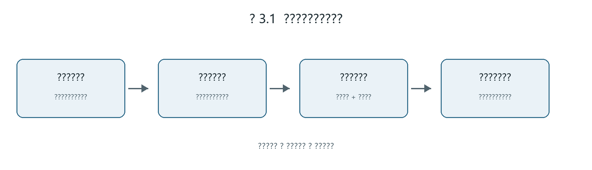
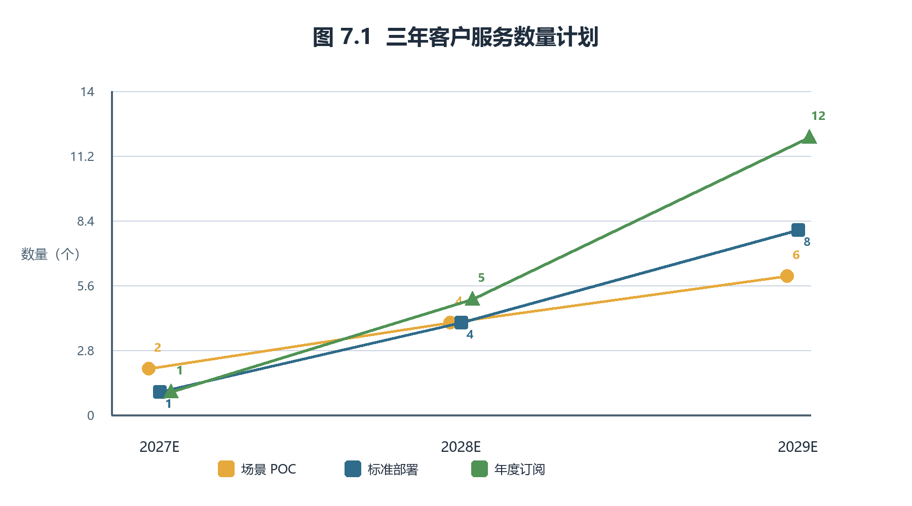
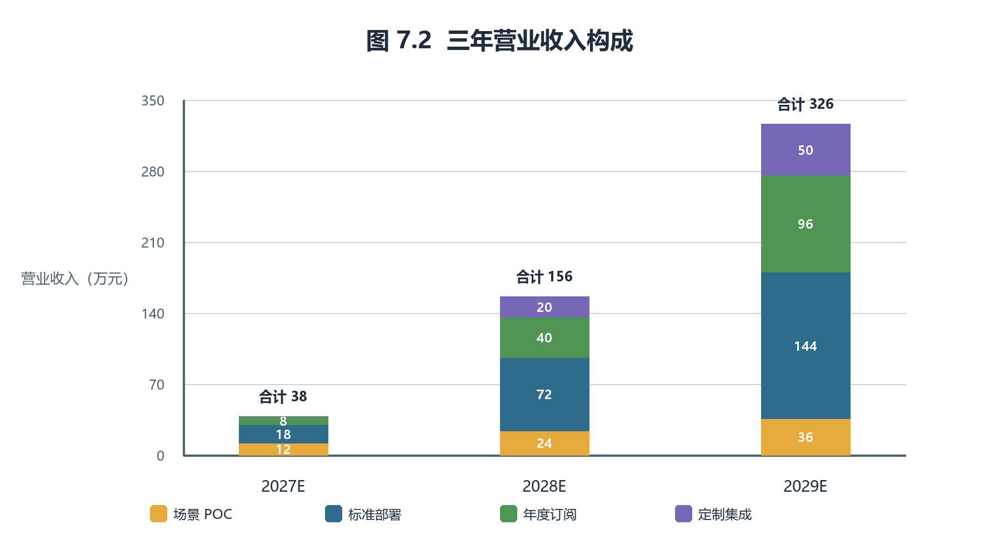
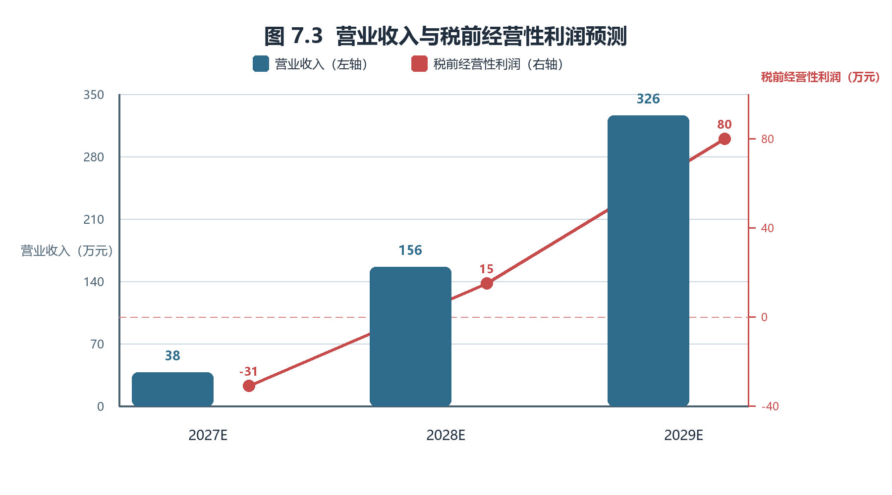
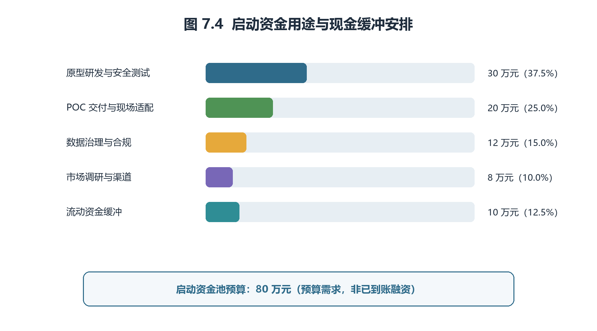

# 第十五届“挑战杯”中国大学生创业计划竞赛商业计划书

## 智检云盾——面向装备制造的多工厂数据安全协同质检平台

赛道：东北振兴产业升级专项赛·数智赋能产业  
版本：扩展图表版（2026 年 7 月）

> 真实性说明：本计划书基于团队已提供的信息和公开资料编制。项目目前为方案设计与原型构建阶段；文中未将客户合同、真实工厂数据、专利、软著、营收、融资或团队履历写成既有事实。财务数字为经营测算，不是现有主体的历史收入。智检云盾为团队面向工业质检场景自主研发的平台，核心技术路线为自主设计并持续迭代的安全多方协同训练与改进 DPSGD 算法；其性能与安全性仍需以可复现实验和后续第三方测试为准。

## 目录

一、执行摘要

二、项目概述

三、项目优势

四、市场分析

五、商业模式

六、团队介绍

七、财务分析

八、融资需求

九、风险控制

十、未来展望

参考资料与提交前核验事项

# 一、执行摘要

装备制造企业普遍需要用机器视觉识别零件表面的划伤、裂纹、凹坑、气孔、焊缝和涂装异常，但罕见缺陷样本分散在整机厂、零部件厂和检测机构，单个工厂难以获得足够数据；直接集中图像、工艺参数和批次信息又会暴露工艺秘密与供应链责任。智检云盾提供“数据不出厂、模型可协同”的多工厂数据安全协同质检平台：企业在本地处理质检图像，各方在秘密共享协议下联合训练缺陷识别模型，并以差分隐私降低模型发布后的成员推断风险。

项目首期聚焦长春汽车零部件表面缺陷，采用“零部件厂 A—零部件厂 B—检测机构 C”的三方模拟环境完成原型验证；中期复制到沈阳重大装备、哈尔滨电站装备和大连轨道交通装备。平台采用本地视觉特征提取与低维安全协同训练相结合的自主技术路线，以减少敏感数据暴露面和训练通信开销；团队围绕改进 DPSGD 算法、工业数据接口、标签治理、训练编排、模型审计和私有化部署持续进行研发。

商业化遵循小步验证：先以 6 万元/场景的 POC 验证数据边界和模型效果，再以 18 万元/节点的标准部署费与 8 万元/节点/年的订阅服务费形成收入。测算假设首年完成 2 个 POC、1 个部署和 1 个订阅节点，收入 38 万元、仍处投入期；第二年在 4 个 POC、4 个新部署、5 个订阅节点基础上实现经营性盈利；第三年通过 8 个新部署、12 个订阅节点和定制集成形成规模。项目负责人现有登记主体为永清县臻青奇百货店（个体工商户），统一社会信用代码为 92131023MAEB0MJR4L，经营者为李旭杰，资金数额为 1 万元，成立于 2025 年 1 月 18 日，目前状态为存续。该主体信息由项目负责人提供；其经营范围及与本项目的承载关系仍须以营业执照原件和实际业务为准。正式签约、处理客户数据或引入股权资金前，应核验主体资质并视业务需要调整为适配的软件技术服务主体。

# 二、项目概述

## 1. 项目背景与痛点

东北拥有汽车、重大装备、能源电力装备、轨道交通装备和机床等传统产业基础。质量检测既关系产品可靠性，也直接影响售后成本与供应链协作。当前视觉质检面临两个同时存在的问题：其一，长尾缺陷样本少，单厂模型容易误报或漏报；其二，工艺图片、加工参数、批次与供应商信息属于敏感生产数据，企业不能轻易交给同行或公共云端。

现有单厂视觉系统解决了“看得见”的问题，却没有解决产业链“共同学习而不泄露”的问题。智检云盾以安全多方计算和差分隐私为底层手段，将协同训练限定在参与方约定的任务、数据范围与模型版本内，帮助装备制造企业在不转移原始数据的前提下改善缺陷识别能力。该定位契合专项赛“数智赋能产业”对装备制造等传统优势产业智能化、融合化发展的导向。

## 2. 项目定位与阶段

项目定位为面向装备制造产业链的私有化安全协同质检软件与技术服务。首期任务限定为二维表面缺陷图像分类，先完成“正常、划伤、裂纹、凹坑”等可清晰定义的类别；不在首期承诺覆盖所有缺陷、三维测量或高频时序预测性维护。

截至本计划书编制日，项目处于方案设计与原型构建阶段，尚未提供真实工厂数据授权、客户试点合同、第三方测试报告或已实现收入。原型将基于公开或经授权数据集，以及模拟三方节点完成可复现实验。任何“准确率”“降本比例”“客户数量”在没有实证前均不作为既有成果宣传。

## 3. 应用流程与社会价值

典型应用由整机厂/核心制造企业、零部件供应商与检测机构组成。各方保留本地质检图像与标签；平台在本地完成特征提取，并在秘密共享条件下训练共同模型；模型部署回各方本地使用，支持新增图像判别、人工复检队列和版本追溯。

项目有助于减少多方重复建模，增加罕见缺陷样本的有效利用机会，并在数据不出厂的前提下促进供应链质量协同。系统定位为质检人员的辅助工具，高风险质量结论仍需人工复核，避免“算法替代责任主体”的不当表述。

为避免“技术有了、场景不清”的问题，首期项目把交付对象、使用对象和数据边界明确区分：质量部门负责定义缺陷类别和复检标准，信息化部门负责本地节点部署，数据持有方只对本方数据负责，平台只处理经协议确认的任务特征与模型更新。模型输出不是对单件产品的最终质量判定，而是给出缺陷类别、置信度、图片编号和人工复核建议。这样既能进入现有质量流程，也能避免模型结果越权替代企业检验标准。

表 2.1  首期场景的数据边界与责任划分

| 对象 | 本地保留内容 | 可参与协同的内容 | 不纳入首期范围 |
|---|---|---|---|
| 零部件厂 | 原始图像、批次、工艺参数、标签 | 经本地处理的特征份额与训练协议 | 原始图像外传、完整工艺参数共享 |
| 检测机构 | 检测规范、复检记录、标注规则 | 标签口径、验收指标、审计规则 | 对企业生产数据的所有权主张 |
| 平台 | 训练任务、版本与审计配置 | 秘密共享训练编排、受保护模型 | 保存客户完整原始数据 |

# 三、项目优势

## 1. 产品与服务

平台包含四个模块：

（1）本地数据治理模块：完成标签校验、最小必要采集、数据版本与访问权限管理；

（2）本地特征提取模块：使用公开、数据无关的视觉特征提取器将图片转为特征向量，私有图片不离开企业环境；

（3）安全协同训练模块：以秘密共享组织多方训练，对梯度裁剪并加入差分隐私噪声，输出轻量缺陷识别模型；

（4）质检应用与审计模块：提供本地推理、模型版本、训练任务、参与方权限、人工反馈和审计日志管理。

服务分为 POC、标准部署、订阅运维和定制集成四层。POC 用于验证数据边界、任务可行性与验收指标；标准部署完成 1 个本地节点接入和模型交付；订阅服务覆盖版本维护、模型再训练与审计支持；定制集成处理客户现场接口或质量台账适配。

产品不以“大而全平台”进入客户现场，而以可验收的最小闭环进入。POC 阶段交付的不是永久系统，而是《数据边界清单》《缺陷标签规范》《三方训练记录》《模型评测报告》和《下一阶段部署建议》五项成果；只有当客户确认可用、可审计、可接入现有流程后，才进入标准部署。标准部署的基本验收包括：节点可离线运行、训练任务可追溯、模型可回滚、人工复检结果可反馈、参与方权限可撤销。订阅阶段再逐步增加模型迭代、日志审计和现场运维，避免项目在首期承担无法交付的复杂接口与大规模数据治理任务。

为保证交付结果能够复用，平台把每次 POC 视为一套“可沉淀的场景包”而不是一次性演示。场景包至少包含缺陷类别字典、样本质量检查规则、训练参数版本、验收集划分原则、异常处理流程和复检反馈口径。不同工厂可以保留各自工艺与数据管理方式，但在参与协同前应对“什么算划伤、什么算裂纹、谁负责复核、复核结果如何回写”形成一致约定。这样做的价值不只在于提升一次模型训练的可用性，也在于避免后续客户接入时反复从零定义数据规则。对于样本不足、标注分歧较大或现场网络条件不具备的客户，平台应先输出差距清单和整改建议，而非承诺立即上线；这既保护客户数据边界，也保护团队的交付信誉。

图 3.1  智检云盾的首期交付闭环

## 2. 技术原理与边界

第一步，参与方在本地使用公开、数据无关的特征提取器处理质检图像。第二步，特征与标签被拆分为秘密份额，单一参与方无法据此恢复他方完整输入。第三步，参与方在安全多方计算框架下训练浅层分类模型，并通过差分隐私随机梯度下降保护训练输出。第四步，受保护模型在各方本地部署，对新图像进行推理。

智检云盾采用团队自主设计的“本地特征提取 + 安全协同训练 + 改进 DPSGD 隐私保护更新”技术路线：本地特征提取缩小进入安全计算环节的数据规模；安全多方计算使参与方在约定协议下完成协同训练；改进 DPSGD 算法在梯度裁剪、噪声注入与训练调度之间寻求适合工业质检任务的平衡。平台还将数据接入、标签规则、训练编排、隐私预算配置、审计与私有化部署作为统一产品能力。首期仍聚焦训练与模型迭代，不承诺在未经验证的情况下覆盖云端推理、身份认证或全部工业数据安全问题。

## 3. 差异化与可行性

与单厂视觉质检系统相比，智检云盾服务多方协同但不集中原始数据；与通用隐私计算产品相比，平台提供质检标签、人工复核、模型版本和验收流程；与大规模联邦学习方案相比，项目首期采用适合少量合作主体的秘密共享式多方学习，不将其称为联邦学习。

技术上，首期限定为 3 个参与方、图像分类和浅层模型，避免安全计算在复杂深度网络上的高成本。运营上，先用小样本 POC 确定准确率、时延、通信量、误报漏报和隐私预算，再决定是否进入部署。项目目前未提供自有专利、软著或论文，因此不以知识产权存量作为竞争优势；后续形成成果后须经权属核验再申报。

# 四、市场分析

## 1. 目标客户与行业适配

初始客户应同时满足四项条件：有明确视觉质检任务；存在至少两家可协作的数据持有方；对工艺、批次和质量数据有保密要求；愿意以小范围 POC 验证价值。首期优先服务汽车零部件企业，后续适配重大装备、轨道交通和电站装备。

东北的潜在行业对象包括长春汽车及零部件产业链、沈阳压缩机与泵等重大装备制造、哈尔滨电站装备、大连轨道交通装备及沈阳机床生态。沈鼓集团覆盖大型离心压缩机、往复压缩机和离心泵的研发、设计、制造与服务；哈电集团布局电机、锅炉、汽轮机等发电装备；中车大连覆盖机车、发动机和城市轨道车辆；沈阳机床主营金属切削与数控机床制造。这些公开信息只说明行业适配性，不构成项目已获合作或数据授权的证明。

从采购决策看，项目的关键联系人并非只有信息化负责人。质量负责人关心漏检、误报与人工复检效率；供应链质量负责人关心跨厂缺陷标签能否统一；信息化负责人关心部署安全、接口和运维；企业管理者关心投入是否能分阶段、是否形成可复制能力。因此，销售材料必须同时回答“识别什么缺陷”“数据如何不出厂”“部署后谁来用”“验收不通过怎么办”“每一笔费用买到什么”五个问题，而不能只展示算法名称。

表 4.1  客户角色与价值主张

| 客户角色 | 主要顾虑 | 智检云盾的对应价值 | 首期可验证指标 |
|---|---|---|---|
| 质量负责人 | 罕见缺陷漏检、复检压力 | 多方样本协同与人工复检队列 | 召回率、误报率、复检时长 |
| 信息化负责人 | 数据泄露、部署复杂、维护负担 | 本地节点、权限审计、可回滚版本 | 数据边界、训练日志、上线时延 |
| 供应链质量负责人 | 标签口径不同、责任不清 | 缺陷标签规范与协同训练协议 | 标签一致性、参与方权限 |
| 企业管理者 | 投入回收不清、项目失控 | POC 先行、阶段验收、订阅续费 | POC 转部署率、单位交付成本 |

## 2. 市场进入与竞品定位

市场进入不采用“全国市场规模乘市场份额”的倒推法，而采用可执行的客户路径：先完成 2 个 POC，验证一套可复用交付流程；第二年通过检测机构、智能制造集成商、产业园和行业活动获取 4 个新部署客户；第三年在已有案例基础上复制至 8 个新部署客户。每一步都受团队交付能力、客户验收与数据条件约束。

竞品包括传统机器视觉厂商、工业互联网平台和通用隐私计算服务商。传统厂商擅长单厂现场交付，通用安全厂商擅长底层能力，智检云盾的切入点是多方数据边界下的质检业务闭环。平台不替代现场相机、检测设备或人工质量责任，而是与其集成。

表 4.2  竞争定位比较

| 方案类型 | 主要优势 | 常见局限 | 智检云盾的协同方式 |
|---|---|---|---|
| 单厂机器视觉系统 | 已有相机、算法与现场经验 | 数据通常局限于单厂，长尾缺陷样本不足 | 可作为本地采图与推理端接入 |
| 工业互联网/云平台 | 设备连接、数据管理能力较强 | 客户可能顾虑原始数据集中与权限边界 | 以本地节点和安全训练补足协同能力 |
| 通用隐私计算服务 | 安全技术基础较深 | 缺少质检标签、复检、验收等业务流程 | 以质检场景包和审计流程形成产品化交付 |
| 智检云盾 | 多方协同、数据不出厂、质检闭环 | 早期只适用小规模合作主体和明确图像任务 | 先与集成商、检测机构互补合作 |

# 五、商业模式

## 1. 产品定价与收入逻辑

以下价格是供财务测算使用的拟定标准报价，实际报价须根据数据复杂度、节点数量、现场环境与安全要求确定。

| 产品/服务 | 拟定含税前报价 | 交付内容 | 直接交付成本假设 |
|---|---:|---|---:|
| 场景 POC | 6 万元/场景 | 数据边界梳理、三方模拟训练、评测与验收报告 | 2.5 万元/场景 |
| 标准私有化部署 | 18 万元/节点 | 节点安装、模型初始交付、权限与审计配置 | 8.5 万元/节点 |
| 年度订阅服务 | 8 万元/节点/年 | 版本维护、模型再训练、运行审计与支持 | 2.5 万元/节点/年 |
| 定制集成 | 10 万元/项 | 现场接口、台账或流程适配 | 4 万元/项 |

POC 是获客和验收入口，标准部署提供一次性实施收入，订阅服务形成后续可预测收入，定制集成只在客户确有接口需求时开展。所有收入以合同、交付和验收为确认基础；在没有合同前，计划书中的客户数与收入都只是测算假设。

## 2. 运营流程与回款安排

运营流程为：需求访谈与保密约定 → 数据边界/验收指标确认 → POC → 阶段验收 → 部署与本地培训 → 订阅运维与季度评估。为匹配早期现金流，拟议回款安排为：POC 合同签订收取 50%、验收收取 50%；部署合同签订收取 30%、上线验收收取 60%、稳定运行后收取 10%；年度订阅按年预收。该安排是拟议商务规则，须在具体合同中依法约定。

平台原则上不保存客户原始图像。日志、配置和诊断信息实行最小化采集、权限审批、加密存储与限期保留。参与方、训练目的、数据范围、模型版本和隐私预算均应留存可追溯记录。

## 3. 营销与渠道

首期以行业调研、联合 POC 和验收案例建立信任，不以未经验证的准确率做宣传。渠道包括东北地区智能制造产业园、检测机构、工业互联网平台、设备集成商和行业协会。营销重点不是“最先进算法”，而是客户可理解的价值：数据不出厂、协同可验收、模型可追溯。

首批客户筛选采用“场景成熟度优先于企业规模”的原则。具体而言，优先选择已有视觉采集设备、能够提供历史复检记录、至少存在两方协作诉求、且质量部门愿意参与验收定义的场景；对于只有模糊需求、缺少数据负责人或希望一次性覆盖全厂的机会，先保持调研关系而不直接进入高成本实施。客户沟通中，团队应将采购决策拆分为业务价值、信息安全、现场实施和付款验收四个议题：业务侧确认缺陷任务与人工复检负荷，信息化侧确认节点部署和权限边界，现场侧确认相机/台账接口条件，管理层确认预算、回款节点和责任主体。以此形成统一的 POC 立项清单，降低销售承诺与实际交付脱节的风险。渠道伙伴的角色也应清晰：检测机构提供检测规则与验收协同，集成商提供现场接口经验，产业园和协会提供触达场景；平台始终对自身的软件交付、训练流程和审计能力负责。

# 六、团队介绍

## 1. 团队配置

团队当前已明确两名核心成员。李旭杰负责项目总体推进与算法路线，胡思佳负责工业场景梳理与产品运营。两人均应在答辩和后续材料中以实际完成的任务、实验记录与调研成果说明贡献，不虚构未发生的企业经历、技术成果或客户资源。

| 成员 | 当前角色 | 核心职责 | 近期可交付成果 |
|---|---|---|---|
| 李旭杰 | 项目负责人、算法负责人 | 明确项目边界；搭建安全协同训练原型；制定模型评测与隐私预算方案；统筹主体与合规事项 | 原型代码、实验记录、算法说明、项目推进台账 |
| 胡思佳 | 工业应用负责人、产品运营负责人 | 梳理质检流程与标签口径；设计 POC 验收方案；完成客户访谈、产品原型与运营材料 | 场景调研纪要、标签规范、产品流程、访谈与验收文档 |

安全工程、前端/部署和财务合规等任务暂由两位核心成员协同推进，后续可根据真实成员加入情况补充。由于尚未提供指导教师信息，本计划书不列示具体导师；提交竞赛材料时也应按要求隐去推报单位和导师身份信息。

## 2. 顾问与协作原则

后续可邀请工业视觉、密码学、数据合规和制造质量管理领域专家提供指导，但只能在获得本人同意、存在实际指导关系时列示。项目已将“技术正确性”和“场景可交付性”分配给不同角色：李旭杰负责算法原型与实验，胡思佳负责质检流程、用户需求和运营闭环。每周以任务清单、版本记录和调研纪要同步进度；涉及安全参数、数据边界和对外承诺的事项由两人共同确认。竞赛提交版还应按要求隐去指导教师姓名等推报单位信息。

# 七、财务分析

## 1. 测算口径与关键假设

本章是项目经营预算，不是永清县臻青奇百货店（个体工商户）的历史财务报表。考虑到项目尚处原型阶段、工业客户决策周期较长，测算不假设首年大规模销售，也不以市场占有率倒推收入。收入完全由第五章的服务单价与客户数量推导；成本由每项交付的直接成本及团队研发、销售、管理投入推导。

测算采用公历年度、人民币万元为单位。首年以 POC 验证为主，预计亏损；第二年在复用部署工具与订阅收入基础上接近平衡；第三年在不显著增加固定资产的前提下实现经营性盈利。税务、开票主体和适用税率取决于最终主体及业务安排，未获会计师确认前不将预测写成法定财务报表。

## 2. 三年收入预测

| 收入项目 | 单价（万元） | 2027E 数量 | 2027E 收入 | 2028E 数量 | 2028E 收入 | 2029E 数量 | 2029E 收入 |
|---|---:|---:|---:|---:|---:|---:|---:|
| 场景 POC | 6 | 2 | 12 | 4 | 24 | 6 | 36 |
| 标准部署 | 18 | 1 | 18 | 4 | 72 | 8 | 144 |
| 年度订阅 | 8 | 1 | 8 | 5 | 40 | 12 | 96 |
| 定制集成 | 10 | 0 | 0 | 2 | 20 | 5 | 50 |
| **营业收入合计** | — | — | **38** | — | **156** | — | **326** |

客户数量与服务数量的关系为：POC 不必全部转化为部署；订阅节点来自已部署且进入运维期的客户；定制集成只按少数客户需求计算。2028 年 5 个订阅节点包含 2027 年已部署节点与当年较早完成部署的节点，2029 年 12 个订阅节点同理。该逻辑避免将所有线索或所有 POC 都视为立即付费客户。

图 7.1  三年客户服务数量计划

图 7.2  三年营业收入构成

## 3. 成本、利润与现金节奏

直接成本按第五章的单项成本测算。固定性费用包括研发/交付人力、销售差旅与客户沟通、合规及日常管理。首年投入较高且客户转化慢，因此保留亏损和现金缓冲；第二年并不假设收入“飞速增长”，而是依托 4 个部署和 5 个订阅逐步摊薄研发投入。

| 项目（万元） | 2027E | 2028E | 2029E |
|---|---:|---:|---:|
| 营业收入 | 38 | 156 | 326 |
| 直接交付成本 | 16 | 65 | 133 |
| **毛利** | **22** | **91** | **193** |
| 研发与交付人力 | 38 | 50 | 75 |
| 销售与客户实施 | 6 | 12 | 18 |
| 管理、合规及云资源 | 9 | 14 | 20 |
| **经营性利润（税前估算）** | **-31** | **15** | **80** |
| 毛利率 | 57.9% | 58.3% | 59.2% |
| 税前经营利润率 | -81.6% | 9.6% | 24.5% |

首年亏损的主要原因是研发与 POC 交付人力先于规模化收入投入；第二年盈利来自部署与订阅的组合而非单纯增加 POC；第三年毛利率小幅提高，原因是部署脚本、标签规范和审计模块可复用。若实际客户验收延后、订阅续费低于预期或现场集成成本上升，应下调收入并延后盈亏平衡，不应维持原预测数字。

为使成本与产品定价能够相互核对，直接交付成本主要包括现场调研与差旅、环境安装、训练计算资源、数据清洗与标注复核、交付人力和后续支持；研发与交付人力则包括算法、安全、产品和现场实施的基础投入。首年直接成本 16 万元对应 2 个 POC、1 个部署和 1 个订阅节点，不假设一次性采购昂贵生产设备；第二、三年直接成本随部署、订阅和定制集成数量增长，而研发人力增长低于收入增长，体现标准化工具复用带来的边际改善。若客户要求专属硬件、现场长期驻场或额外第三方测评，必须按项目单独报价，不能挤占标准报价的利润。

表 7.3  单项服务的毛利测算口径

| 服务 | 报价（万元） | 直接成本（万元） | 单项毛利（万元） | 毛利率 | 主要成本来源 |
|---|---:|---:|---:|---:|---|
| POC | 6.0 | 2.5 | 3.5 | 58.3% | 调研、实验、现场/远程交付人力 |
| 标准部署 | 18.0 | 8.5 | 9.5 | 52.8% | 节点安装、接口适配、培训与验收 |
| 年度订阅 | 8.0 | 2.5 | 5.5 | 68.8% | 模型维护、再训练、审计与支持 |
| 定制集成 | 10.0 | 4.0 | 6.0 | 60.0% | 客户特定接口、台账和流程适配 |

图 7.3  营业收入与税前经营性利润预测

## 4. 现金流与敏感性

按拟议回款规则，2027 年收入中约 70% 可在当年回收，其余因验收节点跨期；首年经营性资金缺口预计主要来自研发、POC 人力和现场实施。项目不计划在原型阶段购置大型生产设备，优先采用客户本地服务器或按需云资源，以控制固定资产投入。

保守情景下，若 2028 年仅完成 2 个部署、3 个订阅节点且无定制集成，预计收入约 84 万元，将无法覆盖当年固定投入；应采取延后扩招、提高 POC 验收转化、优先续费客户和控制非必要市场支出的措施。该敏感性说明与首年亏损、客户决策周期较长的项目逻辑保持一致。

除年度收入与利润外，项目还应按月维护经营看板，至少跟踪五项指标：有效线索数、已签 POC 数、POC 按期验收率、POC 转标准部署率、订阅续费率。前两项反映获客漏斗，第三、四项反映产品和现场交付是否匹配，第五项则检验订阅服务是否真正产生持续价值。现金管理上，应把“已签合同额”“已验收可确认收入”“已回款现金”分开统计，避免将尚未验收或尚未到账的金额误认为可支配资金；每个项目还应单独记录预计工时、差旅、算力和接口适配成本，持续校正第五章的标准报价。若连续两个季度出现 POC 验收延迟、单项目实际成本显著超过预算或续费意向下降，团队应暂停扩大销售目标，先复盘场景选择、交付模板和定价边界。这样的经营纪律能够使财务预测成为管理工具，而不只是答辩中的增长曲线。

在答辩展示中，上述指标应按“目标、当前记录、差异原因、下一步动作”四栏呈现；尚未形成真实记录的指标，应明确标为计划值或待验证项，不得以预测替代已验证经营事实。

图 7.4  启动资金用途与现金缓冲安排

# 八、融资需求

## 1. 资金需求与用途

截至本计划书编制日，未提供项目已融资、团队已出资或外部投资承诺信息，因此不主张已获得资金。为覆盖首年预计 31 万元经营性亏损、原型安全测试与 POC 交付缓冲，项目拟规划不超过 80 万元的启动资金池；该金额是预算需求，不是已到账融资。

| 用途 | 金额（万元） | 占比 | 与经营计划的对应关系 |
|---|---:|---:|---|
| 原型研发与安全测试 | 30 | 37.5% | 支撑首年训练编排、审计与测试工具 |
| POC 交付与现场适配 | 20 | 25.0% | 支撑 2 个 POC、首个部署的差旅与实施 |
| 数据治理与合规 | 12 | 15.0% | 数据处理约定、标签规范、第三方测试与制度 |
| 市场调研与渠道 | 8 | 10.0% | 行业调研、客户访谈与伙伴拓展 |
| 流动资金缓冲 | 10 | 12.5% | 覆盖验收回款延迟和必要运营支出 |
| **合计** | **80** | **100%** | 与首年投入及现金缺口匹配 |

## 2. 主体、股权与退出安排

现有个体工商户不适合直接承载标准股权融资。项目在签订规模化软件服务合同、处理客户敏感数据或引入外部股权资金前，应核验经营范围、数据处理责任与合同能力，并视实际需要设立或调整为有限责任公司。团队成员出资、股权比例、投资人比例和历史融资均未提供，故不虚构。未来如启动融资，应以真实出资、劳动贡献、知识产权权属和合规尽调为基础确定股权安排，不承诺固定估值、IPO 或投资回报。

# 九、风险控制

| 风险 | 表现 | 防控措施 |
|---|---|---|
| 技术与精度风险 | 差分隐私降低模型精度；安全计算训练较慢 | 首期只做三方、图像分类、浅层模型；以准确率、时延、通信量和隐私预算联合验收 |
| 数据与合规风险 | 工艺秘密、批次信息或客户数据处理不当 | 数据不出厂；最小必要采集；数据处理约定、权限分级、日志审计与退出删除机制 |
| 安全模型风险 | 合谋、实现漏洞或模型滥用 | 明确半诚实与诚实多数假设；代码审查、测试、密钥管理和模型访问审计 |
| 市场与回款风险 | 工业客户决策慢、POC 不转部署、验收延迟 | 分阶段验收与回款；控制固定成本；优先验证高意愿场景；保留现金缓冲 |
| 主体与知识产权风险 | 经营范围不匹配、第三方组件或代码来源不清 | 签约前核验主体；建立代码/数据来源清单；遵守许可证；对自主代码、改进算法与第三方组件分别留存研发和授权记录 |

# 十、未来展望

## 1. 未来一年

完成三方模拟原型，建立可复现实验记录和最小可行产品；围绕一种表面缺陷任务确定数据边界、标签规范、验收指标和隐私预算；完成行业调研与潜在客户访谈；核验项目主体、团队分工和知识产权来源。

## 2. 未来三年

第一阶段形成汽车零部件表面缺陷 POC 包；第二阶段将标准部署和订阅运维复制至重大装备、轨道交通与电站装备的相似视觉任务；第三阶段在客户授权、真实案例和安全评估基础上拓展供应链质量协同服务。项目坚持“先验证、再复制”的节奏：收入增长必须由部署节点、续费节点和交付能力支撑，不以未经验证的市场份额或合作关系作为依据。

# 参考资料与提交前核验事项

## 1. 参考资料

[1] 东北振兴产业升级专项赛赛事介绍、通知说明、提交所需材料（项目工作目录）。

[2] 沈鼓集团行业地位：https://www.shengu.com.cn/xingyediwei/；哈尔滨电气集团企业概况：https://www.harbin-electric.com/gywm/qygk.htm；中车大连企业简介：https://www.crrcgc.cc/dlen/162_10665/162_10674/index.html；沈阳机床官网：https://www.smtcl.com/。

## 2. 提交前必须据实补充或核验

1. 团队成员、专业、真实分工、指导教师与可证明成果；
2. 永清县臻青奇百货店（个体工商户）的营业执照经营范围、统一社会信用代码、经营状态及项目承载关系；
3. 样机、公开/授权数据实验、用户调研、意向客户、合同或数据授权；
4. 自有代码、专利、软著、论文、开源组件及许可证；
5. 真实成本、报价、营收、资金来源、股权与纳税信息；
6. 提交版应隐去学校名称、标志和指导教师姓名等推报单位信息，并对公开项目简介进行脱敏。
