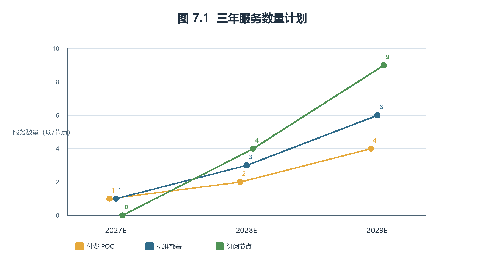
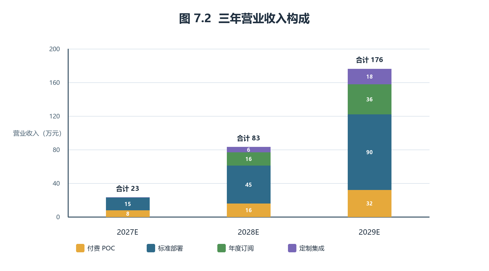
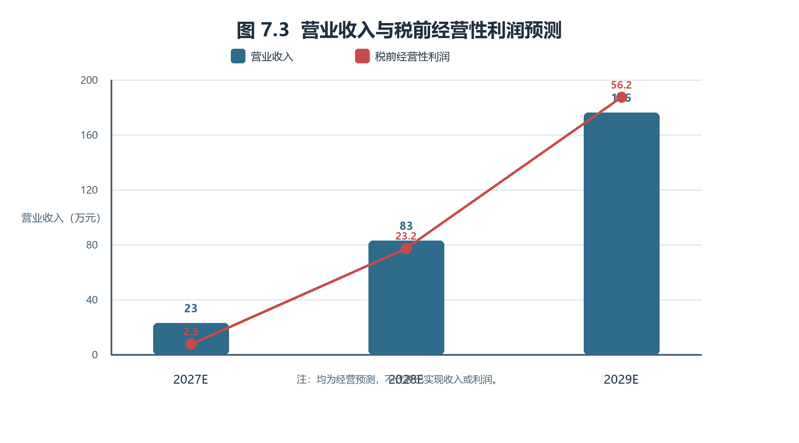
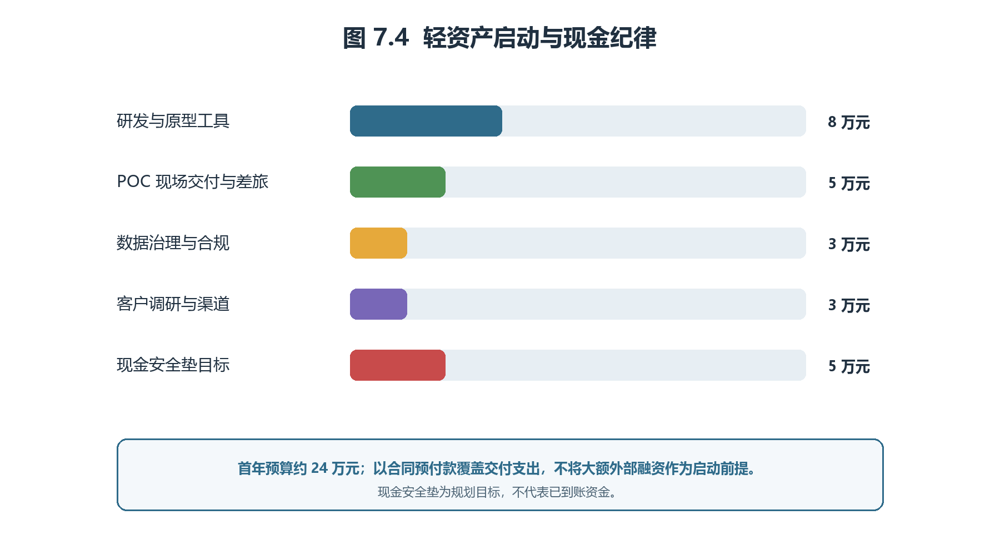

# 第十五届“挑战杯”中国大学生创业计划竞赛商业计划书

## 智检云盾——面向装备制造的多工厂数据安全协同质检平台

赛道：东北振兴产业升级专项赛·数智赋能产业
申报主体：永清县臻青奇百货店（个体工商户）
项目负责人、算法负责人：李旭杰
工业应用负责人、产品运营负责人：胡思佳

# 一、执行摘要

智检云盾面向装备制造产业链，解决的不是“单厂有没有视觉检测算法”，而是“多家工厂各自有少量缺陷图像、却不能直接把图片和工艺数据汇总时，如何共同训练可用模型”。在汽车零部件、铸件、焊缝等场景中，裂纹、划伤、凹坑等缺陷一旦漏检，可能造成返工报废、质量索赔、供应链追溯困难，严重时还会影响装备可靠性。现有单厂视觉系统在标准工况下可以取得较高准确率，但模型训练仍依赖本厂样本；当罕见缺陷、相机条件、材料批次或标签口径发生变化时，模型难以直接复用到其他工厂。更重要的是，质检图像、工艺参数、批次和供应商信息具有商业敏感性，简单集中数据会扩大泄露和责任不清的风险。

项目采用“本地数据治理—安全协同训练—改进 DPSGD 隐私保护更新—本地推理与人工复检”的路径。原始图片留在各参与方本地；只有在任务授权、最小必要和可审计的条件下，参与方才通过秘密共享式安全多方计算完成联合训练；DP-SGD 用于降低最终模型过度记住单条训练样本的风险。首期不把大模型训练、安全多方计算或工业视觉夸大为已完成成果，而是在三方、轻量模型、二维表面缺陷分类的边界内完成原型验证。

数据来源分为三层：第一层是公开基准数据，用于可复现实验和算法对比，例如东北大学公开的 NEU surface defect database（1,800 张热轧钢带表面缺陷图像、6 类缺陷）；第二层是团队在公开数据上生成的训练记录、参数与评测结果；第三层才是后续 POC 中客户书面授权、仅在客户本地节点处理的质检数据。项目不购买、爬取或汇集未经授权的企业缺陷图像，也不把公开数据集表述为客户数据。

商业模式遵循轻资产验证：付费 POC 用于明确数据边界与验收指标，POC 验收后转为标准部署，再以年度订阅形成持续收入。经营预测采用保守的“1 个付费 POC转1个部署节点”首年情景，首年收入 23 万元、税前经营性利润预计 2.3 万元；不再设置首年 31 万元亏损和 80 万元前置融资。所有金额均为经营测算，不代表已签约或已实现收入。

# 二、项目概述

## 1. 项目背景、政策契合与痛点

2026 年是“十五五”开局之年。《中华人民共和国国民经济和社会发展第十五个五年规划纲要》提出坚持以实体经济为着力点，推进制造业智能化、绿色化、融合化发展，实施智能制造工程和工业互联网创新发展工程，并一体推进网络、平台、数据与安全体系建设；国务院《关于深入实施“人工智能+”行动的意见》也强调人工智能应用应坚持开放共享与安全可控。智检云盾聚焦的不是泛化的“上 AI”，而是装备制造质量数据在跨企业协作中的安全使用问题，契合质量强国、制造强国、数据要素安全流通和“人工智能+制造”的共同方向。

装备检测的重要性在于，它直接决定缺陷是否在出厂前被发现。对于零部件表面的裂纹、划伤、凹坑、夹杂、焊缝异常等问题，漏检可能导致后续装配返工、报废、客户投诉、售后索赔和质量追溯成本上升；对承载、密封、传动等关键部件，必须由企业既有检验规范和人工复核作最终判断。机器视觉的价值是把大量重复性筛查前移，帮助质检人员更快定位疑似缺陷，而不是替代质量责任主体。

现有方法并非“检测准确率都不高”。在单一工厂、相机稳定、标签充分、工况变化较小的条件下，传统机器视觉或深度学习模型可以达到较好效果。真正未解决的是两类问题：一是长尾缺陷样本分散在不同供应商和批次，单厂难以持续获得足够的少见样本；二是把多方图片、工艺参数、批次与供应商信息集中到同一平台，会扩大工艺秘密泄露、数据滥用和责任不清的风险。大模型或更大视觉网络可以增强特征表达，但也通常需要更多数据、更高算力和更严格的数据治理，不能自动解决跨企业数据授权问题。

智检云盾因此选择“先协作、再扩展”的路径：在 3—5 个存在合作关系的主体间，以明确的任务、授权、标签口径和审计规则开展协同训练；对是否引入更大视觉模型，以本地特征提取、模型压缩和后续实验结果为依据，而不是承诺直接训练跨企业大模型。

## 2. 项目定位、阶段与数据来源

项目定位为面向装备制造产业链的私有化安全协同质检软件与技术服务。首期任务限定为二维表面缺陷图像分类，先完成“正常、划伤、裂纹、凹坑”等可清晰定义的类别；不在首期承诺覆盖所有缺陷、三维测量、高频时序预测性维护或跨企业大模型预训练。

截至本计划书编制日，项目处于方案设计与原型构建阶段，尚未提供真实工厂数据授权、客户试点合同、第三方测试报告或已实现收入。原型数据来源和使用边界如下：

1. **公开基准数据。** 首期使用公开、可追溯的数据集完成算法基线和可复现实验。拟使用东北大学公开的 NEU surface defect database 作为钢材表面缺陷基线；该数据集包含 1,800 张灰度图像和 6 类典型热轧钢带表面缺陷。公开数据仅用于研究验证，使用时遵守数据集发布方的许可和引用要求。
2. **客户授权 POC 数据。** 只有在后续取得企业书面授权、明确数据处理目的、范围、期限和退出机制后，才在客户本地节点处理其质检图像及必要标签。原始图像、批次和工艺参数不上传至团队服务器，不作为无授权的通用训练集。
3. **评测与审计数据。** 平台只保存经约定允许留存的任务配置、模型版本、评测汇总、权限日志和隐私预算等最小必要信息；如需排障，采用脱敏诊断信息并设置保留期限。

任何“准确率”“降本比例”“客户数量”在没有实证前均不作为既有成果宣传。

## 3. 应用流程与社会价值

典型应用由整机厂/核心制造企业、零部件供应商与检测机构组成。各方保留本地质检图像与标签；平台在本地完成特征提取，并在秘密共享条件下训练共同模型；模型部署回各方本地使用，支持新增图像判别、人工复检队列和版本追溯。

项目有助于减少多方重复建模，增加罕见缺陷样本的有效利用机会，并在数据不出厂的前提下促进供应链质量协同。系统定位为质检人员的辅助工具，高风险质量结论仍需人工复核，避免“算法替代责任主体”的不当表述。

为避免“技术有了、场景不清”的问题，首期项目把交付对象、使用对象和数据边界明确区分：质量部门负责定义缺陷类别和复检标准，信息化部门负责本地节点部署，数据持有方只对本方数据负责，平台只处理经协议确认的任务特征与模型更新。模型输出不是对单件产品的最终质量判定，而是给出缺陷类别、置信度、图片编号和人工复核建议。这样既能进入现有质量流程，也能避免模型结果越权替代企业检验标准。

表 2.1  首期场景的数据边界与责任划分

| 对象 | 本地保留内容 | 可参与协同的内容 | 不纳入首期范围 |
|---|---|---|---|
| 零部件厂 | 原始图像、批次、工艺参数、标签 | 经本地处理的特征份额与训练协议 | 原始图像外传、完整工艺参数共享 |
| 检测机构 | 检测规范、复检记录、标注规则 | 标签口径、验收指标、审计规则 | 对企业生产数据的所有权主张 |
| 平台 | 训练任务、版本与审计配置 | 秘密共享训练编排、受保护模型 | 保存客户完整原始数据 |

# 三、项目优势

## 1. 产品与服务

平台包含四个模块：

（1）本地数据治理模块：完成标签校验、最小必要采集、数据版本与访问权限管理；

（2）本地特征提取模块：使用公开、数据无关的视觉特征提取器将图片转为特征向量，私有图片不离开企业环境；

（3）安全协同训练模块：以秘密共享组织多方训练，对梯度裁剪并加入差分隐私噪声，输出轻量缺陷识别模型；

（4）质检应用与审计模块：提供本地推理、模型版本、训练任务、参与方权限、人工反馈和审计日志管理。

服务分为 POC、标准部署、订阅运维和定制集成四层。POC 用于验证数据边界、任务可行性与验收指标；标准部署完成 1 个本地节点接入和模型交付；订阅服务覆盖版本维护、模型再训练与审计支持；定制集成处理客户现场接口或质量台账适配。

产品不以“大而全平台”进入客户现场，而以可验收的最小闭环进入。POC 阶段交付的不是永久系统，而是《数据边界清单》《缺陷标签规范》《三方训练记录》《模型评测报告》和《下一阶段部署建议》五项成果；只有当客户确认可用、可审计、可接入现有流程后，才进入标准部署。标准部署的基本验收包括：节点可离线运行、训练任务可追溯、模型可回滚、人工复检结果可反馈、参与方权限可撤销。订阅阶段再逐步增加模型迭代、日志审计和现场运维，避免项目在首期承担无法交付的复杂接口与大规模数据治理任务。

为保证交付结果能够复用，平台把每次 POC 视为一套“可沉淀的场景包”而不是一次性演示。场景包至少包含缺陷类别字典、样本质量检查规则、训练参数版本、验收集划分原则、异常处理流程和复检反馈口径。不同工厂可以保留各自工艺与数据管理方式，但在参与协同前应对“什么算划伤、什么算裂纹、谁负责复核、复核结果如何回写”形成一致约定。这样做的价值不只在于提升一次模型训练的可用性，也在于避免后续客户接入时反复从零定义数据规则。对于样本不足、标注分歧较大或现场网络条件不具备的客户，平台应先输出差距清单和整改建议，而非承诺立即上线；这既保护客户数据边界，也保护团队的交付信誉。

图 3.1  智检云盾的首期交付闭环

## 2. 技术原理与边界

第一步，参与方在本地使用公开、数据无关的特征提取器处理质检图像。第二步，特征与标签被拆分为秘密份额，单一参与方无法据此恢复他方完整输入。第三步，参与方在安全多方计算框架下训练浅层分类模型，并通过差分隐私随机梯度下降保护训练输出。第四步，受保护模型在各方本地部署，对新图像进行推理。

智检云盾采用团队自主设计的“本地特征提取 + 安全协同训练 + 改进 DPSGD 隐私保护更新”技术路线：本地特征提取缩小进入安全计算环节的数据规模；安全多方计算使参与方在约定协议下完成协同训练；改进 DPSGD 算法在梯度裁剪、噪声注入与训练调度之间寻求适合工业质检任务的平衡。平台还将数据接入、标签规则、训练编排、隐私预算配置、审计与私有化部署作为统一产品能力。首期仍聚焦训练与模型迭代，不承诺在未经验证的情况下覆盖云端推理、身份认证或全部工业数据安全问题。

## 3. 差异化与可行性

与单厂视觉质检系统相比，智检云盾服务多方协同但不集中原始数据；与通用隐私计算产品相比，平台提供质检标签、人工复核、模型版本和验收流程；与大规模联邦学习方案相比，项目首期采用适合少量合作主体的秘密共享式多方学习，不将其称为联邦学习。

技术上，首期限定为 3 个参与方、图像分类和浅层模型，避免安全计算在复杂深度网络上的高成本。运营上，先用小样本 POC 确定准确率、时延、通信量、误报漏报和隐私预算，再决定是否进入部署。项目目前未提供自有专利、软著或论文，因此不以知识产权存量作为竞争优势；后续形成成果后须经权属核验再申报。

# 四、市场分析

## 1. 目标客户与行业适配

初始客户应同时满足四项条件：有明确视觉质检任务；存在至少两家可协作的数据持有方；对工艺、批次和质量数据有保密要求；愿意以小范围 POC 验证价值。首期优先服务汽车零部件企业，后续适配重大装备、轨道交通和电站装备。

东北的潜在行业对象包括长春汽车及零部件产业链、沈阳压缩机与泵等重大装备制造、哈尔滨电站装备、大连轨道交通装备及沈阳机床生态。沈鼓集团覆盖大型离心压缩机、往复压缩机和离心泵的研发、设计、制造与服务；哈电集团布局电机、锅炉、汽轮机等发电装备；中车大连覆盖机车、发动机和城市轨道车辆；沈阳机床主营金属切削与数控机床制造。这些公开信息只说明行业适配性，不构成项目已获合作或数据授权的证明。

从采购决策看，项目的关键联系人并非只有信息化负责人。质量负责人关心漏检、误报与人工复检效率；供应链质量负责人关心跨厂缺陷标签能否统一；信息化负责人关心部署安全、接口和运维；企业管理者关心投入是否能分阶段、是否形成可复制能力。因此，销售材料必须同时回答“识别什么缺陷”“数据如何不出厂”“部署后谁来用”“验收不通过怎么办”“每一笔费用买到什么”五个问题，而不能只展示算法名称。

表 4.1  客户角色与价值主张

| 客户角色 | 主要顾虑 | 智检云盾的对应价值 | 首期可验证指标 |
|---|---|---|---|
| 质量负责人 | 罕见缺陷漏检、复检压力 | 多方样本协同与人工复检队列 | 召回率、误报率、复检时长 |
| 信息化负责人 | 数据泄露、部署复杂、维护负担 | 本地节点、权限审计、可回滚版本 | 数据边界、训练日志、上线时延 |
| 供应链质量负责人 | 标签口径不同、责任不清 | 缺陷标签规范与协同训练协议 | 标签一致性、参与方权限 |
| 企业管理者 | 投入回收不清、项目失控 | POC 先行、阶段验收、订阅续费 | POC 转部署率、单位交付成本 |

## 2. 市场进入与竞品定位

市场进入不采用“全国市场规模乘市场份额”的倒推法，而采用可执行的客户路径：先完成 2 个 POC，验证一套可复用交付流程；第二年通过检测机构、智能制造集成商、产业园和行业活动获取 4 个新部署客户；第三年在已有案例基础上复制至 8 个新部署客户。每一步都受团队交付能力、客户验收与数据条件约束。

竞品包括传统机器视觉厂商、工业互联网平台和通用隐私计算服务商。传统厂商擅长单厂现场交付，通用安全厂商擅长底层能力，智检云盾的切入点是多方数据边界下的质检业务闭环。平台不替代现场相机、检测设备或人工质量责任，而是与其集成。

表 4.2  竞争定位比较

| 方案类型 | 主要优势 | 常见局限 | 智检云盾的协同方式 |
|---|---|---|---|
| 单厂机器视觉系统 | 已有相机、算法与现场经验 | 数据通常局限于单厂，长尾缺陷样本不足 | 可作为本地采图与推理端接入 |
| 工业互联网/云平台 | 设备连接、数据管理能力较强 | 客户可能顾虑原始数据集中与权限边界 | 以本地节点和安全训练补足协同能力 |
| 通用隐私计算服务 | 安全技术基础较深 | 缺少质检标签、复检、验收等业务流程 | 以质检场景包和审计流程形成产品化交付 |
| 智检云盾 | 多方协同、数据不出厂、质检闭环 | 早期只适用小规模合作主体和明确图像任务 | 先与集成商、检测机构互补合作 |

# 五、商业模式

## 1. 产品定价、成本依据与收入逻辑

项目采用“付费 POC—标准部署—年度订阅—定制集成”的四层服务。以下为针对三方、轻量模型、既有相机条件场景的内部测算口径，不是已签报价。报价以交付范围为边界：客户如要求新增专属硬件、长期驻场、复杂 MES/ERP 接口或第三方安全测评，须另行报价。

表 5.1  产品定价及直接成本测算

| 产品/服务 | 拟定报价（万元） | 直接成本（万元） | 成本构成与依据 | 交付边界 |
|---|---:|---:|---|---|
| 付费 POC | 8.0/场景 | 3.4 | 实施工时 1.6；数据清洗与标签复核 0.7；算力/软件 0.3；调研差旅 0.5；测试报告与预留 0.3 | 三方模拟、数据边界清单、评测报告，不含长期驻场和硬件采购 |
| 标准部署 | 15.0/节点 | 5.8 | 节点安装与接口适配 2.4；安全与审计配置 1.3；培训验收 1.4；交付支持与预留 0.7 | 1 个本地节点、轻量模型、权限审计和培训 |
| 年度订阅 | 4.0/节点/年 | 1.3 | 远程运维与工时 0.7；算力/存储 0.2；模型维护 0.2；工单与预留 0.2 | 版本维护、模型再训练、审计支持；现场长期服务另计 |
| 定制集成 | 6.0/项 | 2.4 | 接口开发与测试 1.5；现场联调 0.5；验收与预留 0.4 | 单一质量台账或现场接口适配 |

成本依据来自项目拆分后的预计工时、差旅、按需算力、软件工具、标签复核和验收支持，不含客户自行采购的相机、服务器、网络改造和生产线改造费用。每个 POC 启动前，团队必须用实际工时和不少于三项外部报价或资源询价校正成本表；报价、成本和回款资料应留存为财务附件。

付费 POC 是验证入口，不以免费试用换取不确定的大项目。POC 验收后，客户可选择进入标准部署；订阅服务只在节点稳定运行后开始。所有收入以合同、交付与验收为确认基础，计划书中的客户数量和收入均为测算假设。

## 2. 运营流程与回款安排

运营流程为：需求访谈与保密约定 → 数据边界/验收指标确认 → POC → 阶段验收 → 部署与本地培训 → 订阅运维与季度评估。为匹配早期现金流，拟议回款安排为：POC 合同签订收取 50%、验收收取 50%；部署合同签订收取 30%、上线验收收取 60%、稳定运行后收取 10%；年度订阅按年预收。该安排是拟议商务规则，须在具体合同中依法约定。

平台原则上不保存客户原始图像。日志、配置和诊断信息实行最小化采集、权限审批、加密存储与限期保留。参与方、训练目的、数据范围、模型版本和隐私预算均应留存可追溯记录。

## 3. 营销与渠道

首期以行业调研、联合 POC 和验收案例建立信任，不以未经验证的准确率做宣传。渠道包括东北地区智能制造产业园、检测机构、工业互联网平台、设备集成商和行业协会。营销重点不是“最先进算法”，而是客户可理解的价值：数据不出厂、协同可验收、模型可追溯。

首批客户筛选采用“场景成熟度优先于企业规模”的原则。具体而言，优先选择已有视觉采集设备、能够提供历史复检记录、至少存在两方协作诉求、且质量部门愿意参与验收定义的场景；对于只有模糊需求、缺少数据负责人或希望一次性覆盖全厂的机会，先保持调研关系而不直接进入高成本实施。客户沟通中，团队应将采购决策拆分为业务价值、信息安全、现场实施和付款验收四个议题：业务侧确认缺陷任务与人工复检负荷，信息化侧确认节点部署和权限边界，现场侧确认相机/台账接口条件，管理层确认预算、回款节点和责任主体。以此形成统一的 POC 立项清单，降低销售承诺与实际交付脱节的风险。渠道伙伴的角色也应清晰：检测机构提供检测规则与验收协同，集成商提供现场接口经验，产业园和协会提供触达场景；平台始终对自身的软件交付、训练流程和审计能力负责。

# 六、团队介绍

## 1. 团队配置

团队当前已明确两名核心成员。李旭杰负责项目总体推进与算法路线，胡思佳负责工业场景梳理与产品运营。两人均应在答辩和后续材料中以实际完成的任务、实验记录与调研成果说明贡献，不虚构未发生的企业经历、技术成果或客户资源。

| 成员 | 当前角色 | 核心职责 | 近期可交付成果 |
|---|---|---|---|
| 李旭杰 | 项目负责人、算法负责人 | 明确项目边界；搭建安全协同训练原型；制定模型评测与隐私预算方案；统筹主体与合规事项 | 原型代码、实验记录、算法说明、项目推进台账 |
| 胡思佳 | 工业应用负责人、产品运营负责人 | 梳理质检流程与标签口径；设计 POC 验收方案；完成客户访谈、产品原型与运营材料 | 场景调研纪要、标签规范、产品流程、访谈与验收文档 |

安全工程、前端/部署和财务合规等任务暂由两位核心成员协同推进，后续可根据真实成员加入情况补充。

## 1.1 团队基本信息

李旭杰，项目负责人兼算法负责人，海南大学网络空间安全学院硕士研究生（2025 年至今）。研究方向聚焦隐私计算与人工智能安全，系统学习现代密码学、机器学习、安全多方计算和云计算安全等相关理论与方法，持续跟踪可搜索加密、云计算安全与安全多方计算领域研究进展。在本项目中负责总体技术路线与算法方案设计，围绕多工厂数据安全协同质检场景开展改进 DPSGD 算法、安全协同训练原型、模型评测与隐私预算配置等工作。

【此处填写胡思佳的学校、专业、年级或学历、个人简介及联系方式】

【此处填写其他团队成员姓名、学校/专业、职责及个人简介；如无其他成员请删除本行】

叶俊于中国西安西安电子科技大学获得博士学位，现为海南大学网络空间安全学院教授、博士生导师。他是一名机器学习工程师、人工智能应用工程师和密码学安全工程师。其研究兴趣包括应用密码学、云计算和人工智能。他已在国内外知名学术期刊和会议上发表或合作发表 100 余篇研究论文，并担任多家国际期刊的客座编辑和审稿人，以及众多国内外会议的程序委员会委员。

## 2. 顾问与协作原则

后续可邀请工业视觉、密码学、数据合规和制造质量管理领域专家提供指导，但只能在获得本人同意、存在实际指导关系时列示。项目已将“技术正确性”和“场景可交付性”分配给不同角色：李旭杰负责算法原型与实验，胡思佳负责质检流程、用户需求和运营闭环。每周以任务清单、版本记录和调研纪要同步进度；涉及安全参数、数据边界和对外承诺的事项由两人共同确认。

# 七、财务分析

## 1. 财务策略：先形成正向单元经济，再谈规模

本章为项目经营预测，不是永清县臻青奇百货店（个体工商户）的历史财务报表。导师提出“首年 -31 万元不利于投资判断”的意见是合理的：早期项目可以投入研发，但不能把持续亏损当作默认路径。因此本版采用轻资产、合同预付款、场景验证优先的口径：首年只假设 1 个付费 POC 在验收后转化为 1 个部署节点，不扩招、不采购大型设备、不以外部股权融资作为启动前提。

首年盈利并不等于已经有收入，而是说明在上述服务单价、交付成本和团队兼职/轻量运营假设下，项目有机会实现正向单元经济。若没有签下付费 POC，团队不应按照预测提前扩大人员和固定开支，而应继续用公开数据完成原型和客户调研。税务、开票主体和适用税率须由实际主体和专业人士核验，以下利润为税前经营测算。

## 2. 三年收入预测

表 7.1  三年收入预测及客户服务数量

| 收入项目 | 单价（万元） | 2027E 数量/收入 | 2028E 数量/收入 | 2029E 数量/收入 |
|---|---:|---:|---:|---:|
| 付费 POC | 8.0 | 1 / 8 | 2 / 16 | 4 / 32 |
| 标准部署 | 15.0 | 1 / 15 | 3 / 45 | 6 / 90 |
| 年度订阅 | 4.0 | 0 / 0 | 4 / 16 | 9 / 36 |
| 定制集成 | 6.0 | 0 / 0 | 1 / 6 | 3 / 18 |
| **营业收入合计** | — | **23** | **83** | **176** |

2027 年的关键经营假设只有一条：完成 1 个付费 POC，并由该场景转化 1 个部署节点；不把所有线索、访谈对象或免费测试当作收入。2028 年的订阅节点由已部署客户及当年较早部署的节点构成；2029 年的增长来自可复用的场景包、部署脚本和续费服务，而不是依赖一次性大额项目。若 POC 转部署率、续费率或验收周期低于假设，应立即下调次年销售目标。

图 7.1  三年服务数量计划

图 7.2  三年营业收入构成

## 3. 成本、利润与现金纪律

表 7.2  三年成本与税前经营性利润预测

| 项目（万元） | 2027E | 2028E | 2029E |
|---|---:|---:|---:|
| 营业收入 | 23.0 | 83.0 | 176.0 |
| 直接交付成本 | 9.2 | 31.8 | 67.3 |
| **毛利** | **13.8** | **51.2** | **108.7** |
| 研发与交付人力 | 6.0 | 14.0 | 27.0 |
| 销售、差旅与客户实施 | 1.5 | 4.5 | 7.5 |
| 管理、合规及云资源 | 4.0 | 9.5 | 18.0 |
| **税前经营性利润** | **2.3** | **23.2** | **56.2** |
| 毛利率 | 60.0% | 61.7% | 61.8% |

首年成本的核心不是“压低一切成本”，而是明确不承担重资产：相机、生产线改造和客户本地服务器原则上由客户按其现场方案采购；平台只承担软件、算法、数据治理、训练和交付支持。研发与交付人力按团队在验证期的兼职投入、项目工时和必要外部支持测算，未来若转为全职团队，应同步提高人力成本并重新测算利润，不能沿用本表。

回款规则建议为：付费 POC 签约 50%、验收 50%；标准部署签约 40%、上线验收 50%、稳定运行 10%；年度订阅按年预收。按该规则，首年 POC 与部署的首期预付款可覆盖对应的启动交付支出。团队应按月区分“合同额、验收收入、已回款现金”，并将每次 POC 的实际工时、差旅、算力、接口适配与售后工单录入成本台账。

图 7.3  营业收入与税前经营性利润预测

## 4. 敏感性与止损线

保守情景下，若 2027 年仅完成 1 个付费 POC、未能在当年转部署，则收入为 8 万元，难以覆盖全年预计运营投入。此时的止损动作不是继续投入扩大销售，而是暂停新增固定成本、复盘 POC 验收条件、将原型研发限定在公开数据和低成本环境，并在获得下一笔客户预付款或合规资金前不启动高成本现场适配。若连续两个季度出现验收延期、实际直接成本超过报价 20% 或订阅续费意向明显下降，应重新评估定价和场景选择。

图 7.4  轻资产启动与现金纪律

# 八、资金规划与公司健康发展

## 1. 启动原则与资金安排

项目不把 80 万元外部融资作为原型启动的前提。首期以公开数据原型、客户付费 POC 预付款和轻资产交付为主，规划首年约 24 万元经营预算，其中研发与原型工具 8 万元、POC 交付与差旅 5 万元、数据治理与合规 3 万元、客户调研与渠道 3 万元、现金安全垫目标 5 万元。该预算是经营安排，不代表团队已具备或已获得相应资金。

现有个体工商户资金数额为 1 万元。若需使用客户预付款以外的资金，应如实说明来源、用途和责任；在签订规模化软件服务合同、处理客户敏感数据或引入外部股权资金前，应核验经营范围、合同能力、数据处理责任，并视业务需要设立或调整为适配的软件技术服务主体。

## 2. 未来公司形态

公司健康发展的目标不是短期堆叠项目数量，而是形成“一个可复用场景包、一套可审计部署工具、一组持续续费节点”的软件服务能力。第一阶段，作为小规模技术服务团队，完成汽车零部件表面缺陷的 POC 包和交付模板；第二阶段，形成算法安全、工业实施、客户成功三类明确岗位，服务多个同类节点；第三阶段，在客户授权和真实案例基础上，沉淀跨供应链质量协同服务。

公司收入结构将逐步从一次性 POC/部署，过渡到部署收入与年度订阅并重。管理上坚持四条纪律：不以未签合同计收入；不以未回款支撑扩张；不把客户原始数据作为公司资产；不在没有资质和权责安排前承接高风险数据处理。

# 九、风险控制

表 9.1  主要风险与规避措施

| 风险 | 具体表现 | 规避措施与触发动作 |
|---|---|---|
| 质量与安全风险 | 模型漏检、误报或被误作最终判定 | 保持人工复核和企业检验规范；以召回率、误报率、时延和可追溯性联合验收；高风险类别不得由模型单独放行 |
| 数据与合规风险 | 未授权使用图像、工艺或批次数据；数据越权留存 | 书面授权、目的限定、数据不出厂、最小必要日志、权限分级、保留期限和退出删除机制；无授权不接入 |
| 算法与系统风险 | 安全多方计算开销大、DP-SGD 影响精度、实现存在漏洞 | 首期限定三方和轻量模型；记录隐私预算与测试结果；代码审查、依赖清单、密钥管理与版本回滚 |
| 商业与回款风险 | POC 无法转部署、项目成本失控、验收延期 | 付费 POC、分阶段回款、成本台账、单项目毛利底线；未转部署时停止追加固定投入 |
| 主体与知识产权风险 | 经营范围不匹配、第三方数据/组件权利不清 | 签约前核验主体；建立代码、数据、模型与组件来源清单；遵守许可证；对改进算法保留研发记录 |
| 人员与交付风险 | 团队规模小、关键成员单点依赖 | 形成任务文档、交付清单、代码仓库和客户工单；关键配置双人复核，逐步补充安全工程与工业实施能力 |

# 十、发展规划

## 1. 近期：把一个场景做实

未来 12 个月，完成三方模拟原型、公开数据基线实验、改进 DPSGD 参数对比、缺陷标签规范和 POC 验收模板；围绕汽车零部件表面缺陷开展客户访谈，只有在获得真实授权后再接入客户本地数据。近期里程碑不是“做大平台”，而是拿出可复现的安全、精度、时延、通信量和数据边界证据。

## 2. 中期：形成可复用的交付与订阅能力

在首个场景验收后，固化数据接入清单、部署脚本、训练参数、审计配置和人工复检流程，形成可复制的场景包；通过检测机构和集成商合作进入相近工艺场景。公司的健康指标不只看收入，还看 POC 按期验收率、POC 转部署率、节点续费率、单项目直接成本和回款周期。

## 3. 远期：成为供应链质量协同的软件服务商

在充分授权、合规和真实案例的基础上，逐步从单一表面缺陷分类延展到重大装备、轨道交通和电站装备的相似视觉质量任务。长期目标是成为“多方数据不出域条件下的质量协同软件服务商”：不替代相机设备、检测机构或企业质量责任，而是为产业链提供安全训练、版本审计、质量知识复用和持续运维能力。

# 十一、政策、数据来源与提交前核验

## 1. 本计划书引用的公开依据

1. 《中华人民共和国国民经济和社会发展第十五个五年规划纲要》，2026 年，关于建设现代化产业体系、制造业智能化发展、质量强国和数据安全体系建设的相关内容。
2. 《国务院关于深入实施“人工智能+”行动的意见》（国发〔2025〕11 号），2025 年，关于人工智能与产业深度融合及安全可控的相关要求。
3. 《制造业质量管理数字化实施指南》，工业和信息化部等部门，关于机器视觉、人工智能提升质量检测全面性及质量数据安全能力建设的相关内容。
4. Song Kechen, Yan Yunhui，NEU surface defect database，东北大学公开数据集页面。数据集含 1,800 张热轧钢带表面缺陷图像、6 类缺陷；使用时应遵守发布方许可与引用要求。

## 2. 提交前必须核验的事实

1. 团队实际原型功能、实验结果、代码权属及公开数据使用许可；
2. 任何企业访谈、数据授权、保密协议、意向或 POC 合同；
3. 主体经营范围、合同与开票安排、数据处理责任；
4. 真实工时、供应商询价、报价单、成本台账与资金来源；
5. 竞赛匿名要求：提交版应按通知删除学校名称、标识和指导教师姓名。
